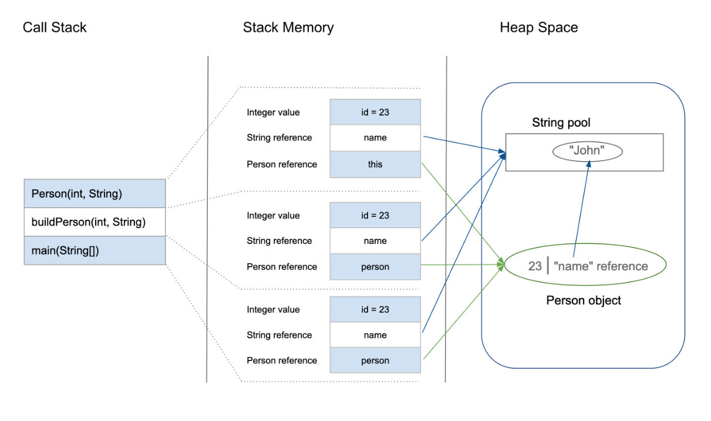
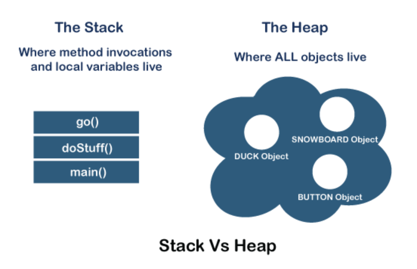
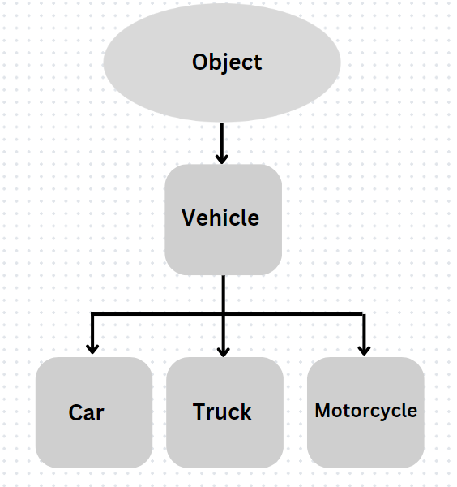

# Stack vs Heap, Casting, Classes and Objects

## Stack vs Heap:

  

KEY (to above picture):
- Person(...) refers to a constructor
- buildPerson(...) refers to a static method
- main(...) refers to the main method

  


Stack:
- Holds primitives and method calls
- LIFO (last in first out: think of a stack of dishes or pancakes)


Heap:
- Stores the actual Objects that the references (Stack) point to
- Has Garbage Collection

## Type Casting (primitive data-types):

- Casting can happen with primitive data-types when we expect the ending type of a variable to be different than what we started with
- two types of casting:
    * Implicit:
        - Happens automatically by java when there is no potential of data loss

        ```
        int a = 32;
        int b = 12;

        double sum = a + b;
        ```

    * Explicit:
        - Must be done manually when there is a POTENTIAL for data loss
        ```
        double a = 12.632;
        int b = 3;

        // Here we explicitly cast 'a' to be an int rather than a double
        int sum = (int)a + b;
        ```

## Class Casting (Object casting):
  

- Is allowed with inherited classes (ex: Vehicle->Parent; Car->Subclass(Child))
- Classes must have an "IS-A-Relationship" (ex: Car IS-A Vehicle)
- Two Types:
    * Upcasting:
    ```
    Vehicle obj = new Car();
    ```

    * Downcasting:
    ```
    //would take two steps
    //For it to work, the Child MUST be an instanceOf the Parent

    Vehicle obj = new Car();

    //The actual downcast. Is ok b/c obj refers to the Child (Car)
    Car c = (Car)obj;
    ```

## Classes and Objects:

- Classes are like blueprints for objects (think plans for a house)
- Objects are the instantiation of a class (think the built house)
- We create objects using constructors:
    * no-arg constructors: (constructors without parameters)
    ```
    public Car(){};
    ```

    * parameterized constructors: 
    ```
    public Car(int numWheels, String make, String model, int year){
        this.numWheels = numWheels;
        this.make = make;
        this.model = model;
        this.year = year;
    }
    ```
